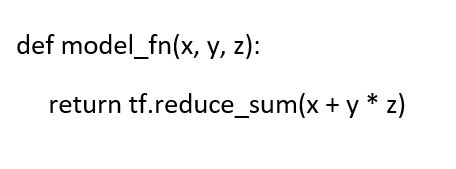
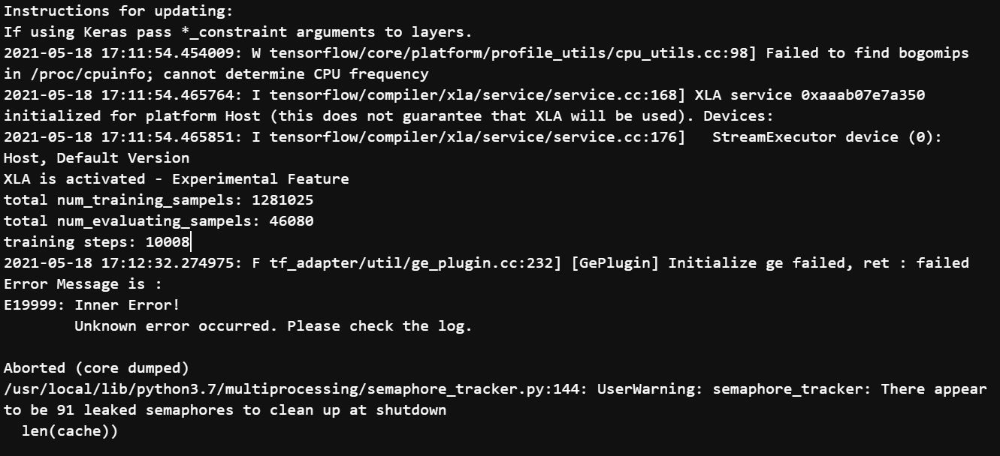
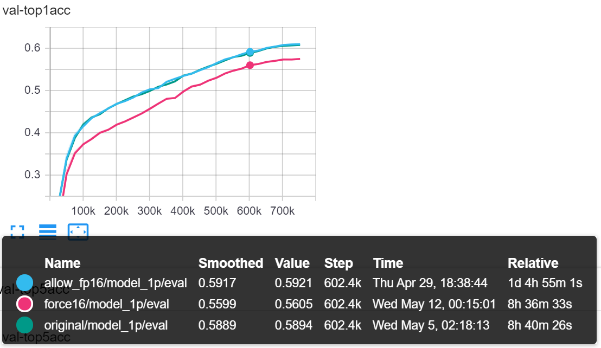
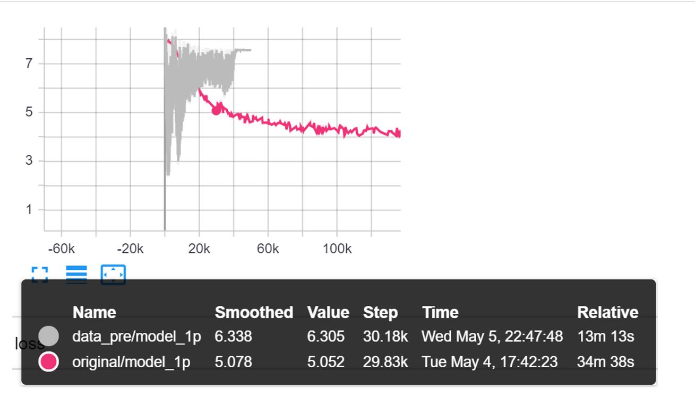
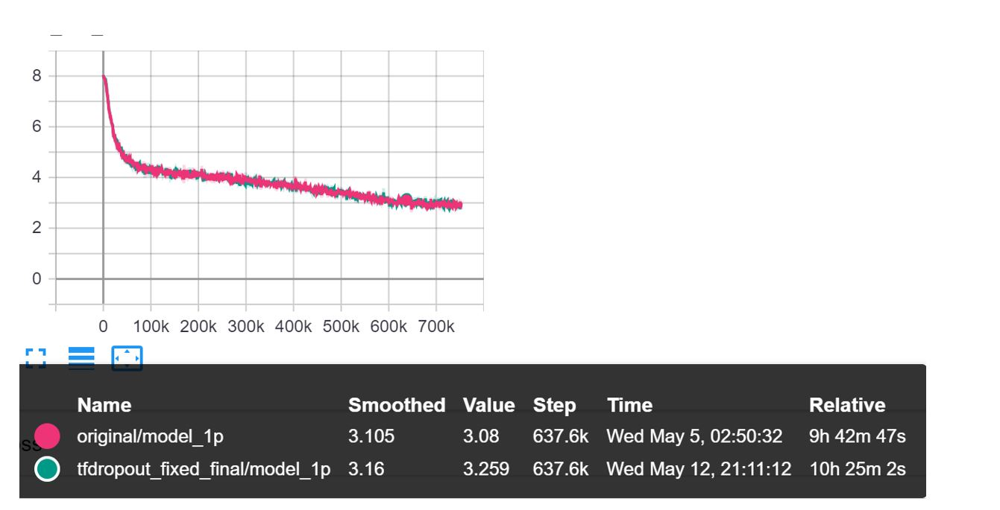

<!-- Insert header and hyperlinks to documentations and Ascend community, and ModelZoo-->
[](https://www.hiascend.com/software/modelzoo)


# Model Training on Huawei's Ascend Environment
 
In this blog we discuss about training deep learning models on Huawei's Ascend environment using Ascend 910 processor. We tried to experiment with various hyperparameters and demonstrate better training performance and loss convergence. For better understanding the environment, we selected to train the AlexNet model for image classification task.

## Introduction to AlexNet Training
<hr/>
AlexNet is a classic image classification network that won the 2012 ImageNet competition. It is the first CNN that successfully applies tricks such as ReLU, Dropout, and LRN, and uses GPUs to accelerate computation. The AlexNet used is based on Tensorflow.

Reference: https://arxiv.org/abs/1404.5997 

Implementation :  https://www.hiascend.com/en/software/modelzoo/detail/2/6b29663a9ab64fde8ad8b9b2ddaf2b05


## Default Configuration for Training
<hr/>
<!--Following sections introduce the default configurations and hyperparameters for AlexNet model.
Optimizer: -->
This model uses the Momentum optimizer from Tensorflow with the following default configurations and hyperparameters:

| Hyperparameters    | Value   |
| -------------------|---------| 
|  Momentum          |   0.9   |
|  Learning rate (LR)|   0.06  |
|  LR schedule       |   cosine annealing  |
| Batch size | 128*8 for 8 NPUs, 256 for single NPU | 
| Weight decay       | 0.0001 | 
| Label smoothing    |  0.1   |

Below are brief descriptions of each hyperparameter:
<!-- Momentum: 0.9<br/>
Learning rate (LR) : 0.06<br/>
LR schedule: cosine_annealing<br>
Batch size : 128*8 for 8 NPUs, 256 for single NPU <br/>
Weight decay : 0.0001. <br/>
Label smoothing = 0.1
-->
- **Momentum** : helps accelerate gradient descent in the relevant direction by dampening oscillator, thus leading to faster convergence.<br/>
- **Learning Rate** : float value that determines the step size of gradient descent when optimizing toward the optimal.
- **LR schedule** : adjusts the learning rate during optimizing.

## Training dataset preprocessing
<hr/>
The input image size for this model is 224 x 224 and are preprocessed before sending them to the model for training. The image preprocessing steps include (but are not limited to):

- Random crop 
- Horizontal flip
- Normalization


## Experiments
<hr/>

We implemented the following parameter changes to give our observations on changes in batch time, loss convergence and training time:

**[parallel execution](#parallel-execution)**<br>
**[allow_soft_placement](#device-allocation)**<br>
**[XLA](#accelerated-linear-algebra)**<br>
**[precision_mode](#precision-mode)**<br>
**[hcom_parallel](#allreduce-gradient)**<br>
**[iterations_per_loop](#iterations-per-loop)**<br>
**[enable_data_pre_proc](#offload-data-preprocessing)**<br>
**[dropout](#dropout)**<br>


### Parallel Execution
**inter_op_parallelism_threads** & **inter_op_parallelism_threads (CreateSession.py)**: Used by tensorflow to parallelise execution.

   - If there is an operation that can be parallelized internally, such as matrix multiplication (tf.matmul()), TensorFlow will execute it by scheduling tasks in a thread pool      with `intra_op_parallelism_threads` threads.
   
   - Operations can be independent in your TF graph because there is no directed path between them in the dataflow graph. TensorFlow will attempt to run them concurrently, using    a thread pool with `inter_op_parallelism_threads` threads.
   
   Default values for both are 0 i.e. the system picks the appropriate number. 
   
   **Results:**
   
   | Threads | Avg Batch Time  | Epochs |
   | ---------------|---------------|-------------|
   |  `intra_op_parallelism_threads`= 0 `inter_op_parallelism_threads`= 0 | ~5.3s  | 5 | 
   |  `intra_op_parallelism_threads` =2  `inter_op_parallelism_threads` = 5 |  ~5.7s  | 5 |
   
### Device Allocation
**allow_soft_placement (CreateSession.py)**: If this option is enabled (=True), the operation will be be placed on CPU if there:

   - No GPU devices are registered or known
   
   - No GPU implementation for the operation
   
   This option only works when your tensorflow is not GPU compiled. If your tensorflow is GPU supported value of `allow_soft_placement` (True or False) does not matter, even if the device is set as CPU. We observe no major difference in training time.
   
   **Results:**
   
   | `allow_soft_placement`  | Avg Batch Time  |
   | ---------------|-------------|
   | `True` |  ~5.4s  |
   | `False`|  ~5.5s   |

### Accelerated Linear Algebra   
**XLA (Accelerated Linear Algebra)**: When a TensorFlow program is run, all of the operations are executed individually by the TensorFlow executor. Each TensorFlow operation has a precompiled GPU kernel implementation that the executor dispatches to. XLA provides an alternative mode of running models. Lets look at the following how XLA optimizing following TF computation: 

   ```python
   def model_fn(x, y, z):
      return tf.reduce_sum(x + y * z) 
   ```
   <!-- -->
     
   Without XLA, the graph launches three kernels: one for the multiplication, one for the addition and one for the reduction. However, XLA can optimize the graph so that it computes the result in a single kernel launch. It does this by "fusing" the addition, multiplication and reduction into a single GPU kernel. 
     
   The fused operation does not write out the intermediate values produced by y\*z and x+y\*z to memory; instead it "streams" the results of these intermediate computations directly to their users while keeping them entirely in GPU registers. Fusion is XLA's single most important optimization and remvoing memory utilization is one of the best ways to improve performance.
  
  **Results:**
  
  As part of the experiment, we observed XLA is activated with GPU version of AlexNet training. We tried activating the same for NPU trainig as well.
  
  Changes were made in `CreateSession.py` and also set the environemnt variable to `XLA_FLAGS=--xla_hlo_profile`. The outcome shows that XLA is not supported for NPU based training interface.
  
  
  
  <!-- -->
  
### Precision Mode
**precision_mode (trainer.py)**: Mixed precision is the combined use of the float16 and float32 data types in training deep neural networks, which reduces memory usage and access frequency. Mixed precision training makes it easier to deploy larger networks without compromising the network accuracy with float32.

   - **allow_mix_precision**: Mixed precision is allowed. For operators of the float32 data type on a network, the precision of some float32 operators can be automatically reduced to float16 based on the built-in optimization policy. In this way, the system performance is improved and the memory usage is reduced with little accuracy loss. Note that the Ascend AI Processor supports only float32 to float16 casting. It is recommended that Loss Scaling be enabled after mixed precision is enabled to compensate for the accuracy loss caused by precision reductionMixed precision is allowed to improve system performance and reduce memory usage with little accuracy loss.
   - **must_keep_origin_dtype**: Retains original precision. 
   - **allow_fp32_to_fp16**: The original precision is preferentially retained. If an operator does not support the float32 data type, the float16 precision is used. 
   - **force_fp16**: If an operator supports both float16 and float32 data types, float16 is forcibly selected.
    
   **Results:**
   The following table compares the loss, accuracy and batch time obtained by using the four precision mode with the baseline. We see that setting `allow_mix_precision=True`         yields the best performace in this experiment setting. 

   | **`precision_mode`** | Loss/Accuracy | Batch Time  |
   | ---------------|---------------|-------------|
   |  `allow_mix_precision`    |   = Baseline   | ~50ms  |
   |  `must_keep_origin_dtype` |   N/A          | NA     |
   |  `allow_fp32_to_fp16`     |   = Baseline   | ~170ms |
   |  `force_fp16`             |   < Baseline   | ~50ms  |

   The figure below shows the Top1 accuracy curve under different precision mode:

   
 
   **Blue:** allow_fp32_to_fp16; **Green:** allow_mix_precision ; **Purple:** force_fp16
   
   Note, using ‘must_keep_origin_dtype’ results in Error:

   

### AllReduce Gradient
**hcom_parallel (trainer.py):**

   Firstly, let's understand importance of AllReduce algorithm in deep learning: 
   
   https://towardsdatascience.com/visual-intuition-on-ring-allreduce-for-distributed-deep-learning-d1f34b4911da

   Whether to enable the AllReduce gradient update and forward and backward parallel execution.

   - **True:** enabled

   - **False (default):** disabled
  
   **Results**
  
   Tested on one NPU, no difference in either loss or batch time

### Iterations per loop
**Iteration_per_loop (train.py):** It is the number of iterations per training loop performed on the device side per sess.run() call. Training is performed according to the specified number of iterations per loop (iterations_per_loop) on the device side and then the result is returned to the host. This parameter can save unnecessary interactions between the host and device and reduce the training time consumption.

  | `iterations_per_loop` | Result – loss/accuracy | Result – Time(100 batches) |
  | ---------------|---------------|-------------|
  |  100    |   No change   | ~5.1s  |
  |  1   |   No change   | ~5.4s  |


### Offload Data Preprocessing
**enable_data_pre_proc (trainer.py):**  Whether to offload the data preprocessing workload to the device side.
  
   •	True (default): enabled

   •	False: disabled
  
   **Results**
  
   
   
   **Purple:** enable_data_pre_proc (True) ; **Grey:** enable_data_pre_proc (False)
  
   | `enable_data_pre_proc` | Result – Batch Time |
   | ---------------|---------------|
   |  `True`    |  ~50ms |
   |  `False`    |  ~20ms |
  
   Based on our observation when ‘enable_data_pre_proc’ is disabled, it does reduce the training time. However the loss does not converge, hence it may not be useful.

### Dropout
**dropout (alexnet.py) :**

Replace dropout in the original network with the corresponding AscendCL API
   
**Results**
   

   
| Type | Loss/Accuracy | Batch Time |
| ---------------|---------------|-------------|
|  `npu_ops.dropout()`    |  No change | ~510ms | 
|  `tf.nn.dropout()`    |  No change | ~550ms |
  
